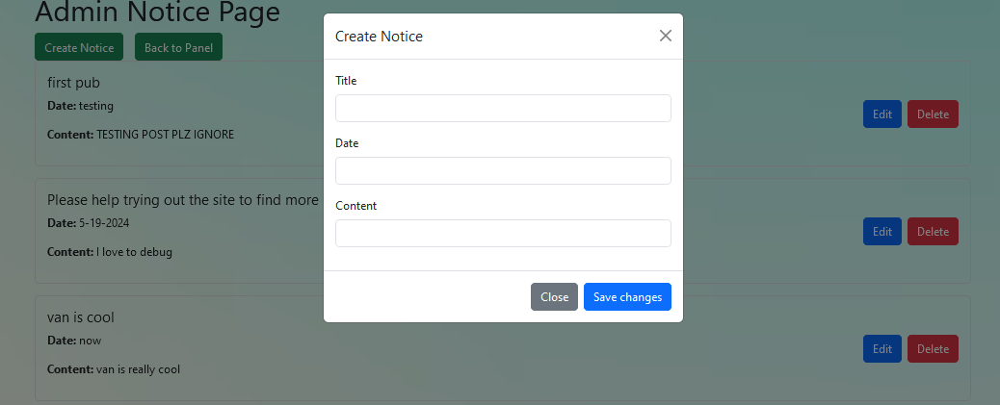

# College Recommender ☺️

## Some Useful Links 🔗

- [Showcase the Project with Pictures](#Showcase)
- [Functionality](#Functionality)
- [Database Setup](#SQL——tables)

---

### What is this Project About? 📚

College Recommender is a full-stack web application designed to help high school students or anyone looking to apply to college find their ideal institutions. Built with React for the front end, Node and Express for the back end, and MySQL for the database, this project offers a range of features:

- **Search Colleges:** Find colleges by name or filter by SAT and GPA ranges.
- **Save Favorites:** Create a list of preferred colleges.
- **Comments and Discussions:** Engage with others by commenting on your favorite choices.
- **Browse Decisions:** View recent college decisions along with students' grades and stats.

---

### How to Run the Application 🏃

1. **Set Up the Database:**
   Ensure you have a MySQL database properly set up. Follow the instructions in the [Database Setup](#database-setup) section.

2. **Start the Front End:**
   Navigate to the `front-end` folder using any IDE. Open a terminal or PowerShell and run:
   ```
   npm start
   ```

3. **Start the Back End:**

 For backend, use any IDE go to the backend folder, on your terminal o powershell type in 
 ```
 nodemon app.js
```

## Functionality ⚙️

### More Detailed Configuration for Database

Tasks

restyle home details page

### Admin

* control panel
  * [X] manage all user accounts
    * [X] add
    * [X] delete
    * [X] edit
    * [X] logout
  * [X] CRUD user notice
    * [X] change adminID to current useAuth admin ID
  * [X] CRUD college
    * [X] CRUD basic infos
    * [X] CRUD college details
  * [X] approve add school request from basic users

### Basic users

* [X] login
* [X] register
  * [X] when register also create a academic profile

* Main home page
  * [X] browse all college
    * [X] make buttons to split page
  * [X] search all college
    * [X] based on name
    * [X] based on range of SAT
    * [X] based on range of GRE
  * [X] add selected college unit to your favorite list
  * [X] read user notice
  * [X] suggest to add new school not in database
* user profile
  * [X] edit username, password
    * [X] after update the username or any info, the useAuth should update as well
  * [X] CRUDemic information: SAT, GPA, extra, others, majors
* school selection page
  * [ ] match current academic profile with fav college saved by that user
  * [ ] suggest closest match college outside of user saved college
* User’s liked/saved college
  * [X] delete liked college

* [X] College Details Page
  * [X] display basics
  * [X] display colelge info/details
  * [X] user can comment on a post
    * [X] delete / edit his own comment
  * [X] College decision graph

### SQL tables

* admin
  * admin id - admin (int)
  * username - usermname (string)
  * password - password (string)
* student / use
  * student id - idusers (int)
  * username - username (string)
  * password - password (int)
  * academic profile
* academic profile  - useracademic
  * academic id (PK) - iduseracademic (int)
  * student id (PK) - idusers  (int)
  * SAT - SAT (int)
  * GPA - GPA (float)
  * Extracurricular - extra (String)
  * comments - others (string)
  * majors - majors (string)
* college basic record - collegebasics
  * basics
    * college id - idCollege
    * college name - collegeName
    * picture - picURL
    * average SAT - aveSAT
    * average GPA - aveGPA
    * tuition - tuition
    * acceptance rate - accRate
    * rank - ranks
    * collge details id - idCollegeDetails
* college infos - collegeinfo
  * academic - academic (string)
  * value - value (string)
  * safety - safety (string)
  * location - location (string)
  * athletics - athletics (string)
  * student life - life (string)
  * details id - idCollegeDetails (PK)
  * college id - idCollege(FK)
* college comments - collegecomments
  * idcollegecomments (int, unique, auto cre)
  * idusers (int)
  * idCollege (int)
  * message (string)
* College Suggests - collegesuggest
  * idcollegesuggest - int
  * college name - collegeName (string)
  * picture - picURL (string)
  * average SAT - aveSAT (INT)
  * average GPA - aveGPA (float)
  * tuition - tuition (int)
  * acceptance rate - accRate (float)
  * rank - ranks (int)
  * approve - approve (string)
* College decisions - collegedecisions
  * idcollegedecisions - int
  * idusers - int
  * idCollege - int
  * SAT - int
  * GPA - float
  * extra - string
  * decision - string
* user’s liked college - userlikedcolleges
  * record id (PK) - iduserlikedcolleges
  * student id -  idusers
  * college id - idCollege
* notice - notice
  * notice id - idnotice
  * title - title
  * info - content
  * date -date

'admin_tls_version', 'TLSv1.2,TLSv1.3'
'immediate_server_version', '999999'
'innodb_version', '8.0.28'
'original_server_version', '999999'
'protocol_version', '10'
'replica_type_conversions', ''
'slave_type_conversions', ''
'tls_version', 'TLSv1.2,TLSv1.3'
'version', '8.0.28'
'version_comment', 'MySQL Community Server - GPL'
'version_compile_machine', 'x86_64'
'version_compile_os', 'Win64'
'version_compile_zlib', '1.2.11'

# Showcase

Main Page:


College details page (need more styling):


Users can access all admin posted notices:


User's saved/liked colleges:


Suggested colleges that closely match with the status of the user:


User can suggest adding a new college that is not in the current database:


User can update their own profiles:


Login page for both admin and users:


Admin panel:


Admin can create new notices:



Admin can manage all colleges:


Admin can edit all info about colleges:


